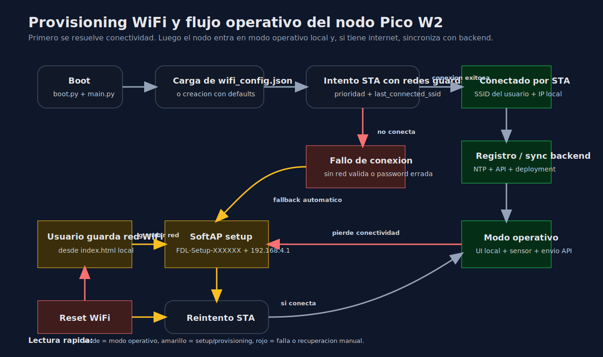
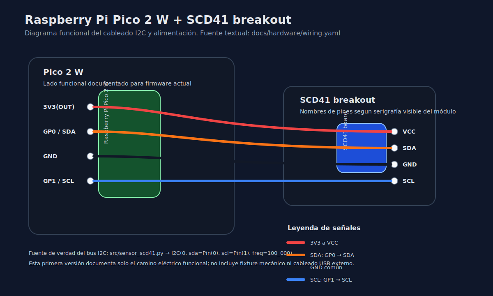

# Firmware IoT - Frontera DataLabs

Firmware de produccion para un nodo ambiental basado en **Raspberry Pi Pico 2 W** y sensor **SCD41**. El codigo que realmente se copia al dispositivo vive en [`src/`](src/).

La secuencia real del sistema es:

1. El nodo arranca y carga su configuracion local.
2. Primero resuelve **WiFi**.
3. Luego entra en modo operativo local.
4. Si tiene internet, sincroniza tiempo y envia datos al backend en `https://api.fronteradatalabs.com`.



## Arquitectura rapida

- Hardware: Raspberry Pi Pico 2 W + SCD41
- Runtime: MicroPython
- UI local: `index.html`, servida por la propia Pico
- Provisioning WiFi: `wifi.py` + `wifi_config.json`
- Configuracion del nodo: `device_config.json`
- Ingesta remota: `https://api.fronteradatalabs.com`
- Dashboard web: `https://dashboard.fronteradatalabs.com`
- Consola administrativa de base de datos: `https://questdb.fronteradatalabs.com`

## Archivos que se copian a la Pico

Todos los archivos dentro de `src/` deben subirse a la **raiz** del filesystem de la Pico.

Archivos esperados:

```text
boot.py
main.py
device_config.py
cloud_buffer.py
remote_questdb_service.py
sensor_scd41.py
scd4x.py
timer_service.py
wifi.py
logger.py
index.html
```

Archivos persistentes que crea o mantiene el propio nodo:

```text
wifi_config.json
device_config.json
cloud_buffer.json
```

## Conexion hardware

Esta primera version documenta solo el **camino electrico funcional** del nodo:

- **Raspberry Pi Pico 2 W**
- **Modulo / breakout SCD41**
- bus **I2C**
- alimentacion de **3V3**

No documenta todavia el fixture mecanico, separadores, soporte impreso ni accesorios externos del montaje.



Resumen de conexiones funcionales:

| Señal | Pico 2 W | SCD41 breakout | Notas |
|---|---|---|---|
| Alimentación 3.3V | `3V3(OUT)` | `VCC` | Alimentación del módulo |
| Tierra | `GND` | `GND` | Tierra común |
| I2C SDA | `GP0` | `SDA` | Definido por firmware en `sensor_scd41.py` |
| I2C SCL | `GP1` | `SCL` | Definido por firmware en `sensor_scd41.py` |

Regla de precedencia para esta documentación:

- para señales de bus, manda el firmware
- para nombres físicos del breakout, manda la serigrafía visible del módulo real

La fuente de verdad textual del diagrama vive en [`docs/hardware/wiring.yaml`](docs/hardware/wiring.yaml), y las notas de regeneración están en [`docs/hardware/README.md`](docs/hardware/README.md).

## Primer uso

### 1. Flashear MicroPython

Descarga el `.uf2` mas reciente para Pico W / Pico 2 W desde:

- [MicroPython for Raspberry Pi Pico](https://micropython.org/download/RPI_PICO_W/)

Instalacion resumida:

1. Conecta la Pico manteniendo presionado `BOOTSEL`.
2. Aparecera como almacenamiento USB.
3. Arrastra el archivo `.uf2`.
4. La placa reinicia automaticamente.

### 2. Copiar el firmware

Sube todos los archivos de `src/` a la raiz del dispositivo usando Thonny, PyCharm o la herramienta MicroPython que prefieras.

### 3. Reiniciar

Puedes reiniciar con:

- `Ctrl + D` desde el REPL
- boton `RESET`
- desconectar y reconectar USB

### 4. Provisioning WiFi inicial

Si la Pico **no** encuentra una red conocida, activa automaticamente su propio **SoftAP de setup**.

Comportamiento esperado:

1. El nodo crea o carga `wifi_config.json`.
2. Si no hay redes validas o no logra conectarse, levanta una red tipo `FDL-Setup-XXXXXX`.
   La clave inicial por defecto del AP de setup es `fdlsetup2026`.
3. Te conectas manualmente a esa red.
4. Abres `http://192.168.4.1`.
5. Guardas una red WiFi valida desde la UI local.
6. El nodo intenta conectar por `STA`.
7. Cuando conecta, apaga el AP de setup y entra en modo operativo normal.

## Flujo de estados del nodo

Estados principales:

- `boot`: arranque del dispositivo
- `sta`: conectado a una red WiFi del usuario
- `setup_ap`: AP propio del nodo para configuracion
- `offline`: no conectado, sin enlace util todavia

Lectura operativa del diagrama:

1. El nodo arranca.
2. Carga `wifi_config.json`.
3. Intenta conectar a redes guardadas, priorizando la ultima red conectada si esta visible.
4. Si conecta, entra en `STA`, sincroniza tiempo, registra backend y sigue operando.
5. Si falla, entra en `setup_ap`.
6. Desde la UI local el usuario guarda o corrige credenciales.
7. El nodo reintenta `STA`.
8. Si el usuario decide limpiar redes, `Reset WiFi` borra `known_networks` y vuelve a setup.

## Configuracion persistente

### `wifi_config.json`

Guarda solamente configuracion de conectividad:

- `known_networks`
- `last_connected_ssid`
- `setup_ap`
- `fallback`

Esto permite:

- tener varias redes conocidas
- cambiar de sitio sin reflashear firmware
- cambiar la password del AP de setup desde la UI
- volver a setup sin tocar el codigo fuente

### `device_config.json`

Guarda configuracion funcional del nodo:

- `board_id`
- `deployment_id`
- `deployment_counter`
- `latitude`
- `longitude`
- `location_name`
- `sample_interval`
- `questdb_interval`
- `device_registered`
- `api_base_url`

Separacion importante:

- `wifi_config.json` = conectividad
- `device_config.json` = identidad y operacion del nodo

## Operacion normal desde la UI local

Una vez dentro de `http://<ip-del-nodo>` o `http://192.168.4.1` en modo setup, la UI local permite:

- ver estado WiFi actual
- distinguir `STA`, `setup_ap` y `offline`
- escanear redes cercanas
- agregar una red WiFi nueva
- editar prioridad y estado de redes guardadas
- intentar conexion inmediata
- eliminar una red guardada
- cambiar la password del AP de setup
- ejecutar `Reset WiFi`
- ver lecturas del sensor
- cambiar intervalos de muestreo y envio
- crear un nuevo deployment local
- habilitar o deshabilitar la subida a la nube
- revisar hasta 10 muestras locales pendientes antes de aprobar la nube
- limpiar el backlog local de muestras
- ver estado de backend, tiempo y logs

## REPL y uso diario

`main.py` se ejecuta automaticamente al arrancar la placa. No hace falta lanzarlo manualmente.

Puedes mantener el REPL abierto para:

- ver logs
- inspeccionar IP
- revisar archivos
- hacer soporte basico

Evita ejecutar repetidamente:

- `import main`
- reseteos agresivos de sockets desde REPL
- reinicios continuos sin esperar a que termine el arranque

## Troubleshooting rapido

### No encuentra red WiFi

- Revisa desde la UI local si el SSID aparece en el escaneo.
- Verifica que la red sea **2.4 GHz**.
- Si la red no esta visible, el nodo permanecera o volvera a `setup_ap`.

### Password incorrecta

- El estado WiFi mostrara error reciente asociado a password.
- Edita la red desde la UI local y guarda una nueva clave.
- Lanza `Conectar ahora` para reintentar sin reiniciar.

### El nodo queda en `setup_ap`

Eso significa que no pudo entrar a `STA` con las redes conocidas.

Pasos recomendados:

1. Conectate al AP del nodo.
2. Abre `http://192.168.4.1`.
3. Revisa las redes guardadas.
4. Corrige o agrega una red valida.
5. Si hay estado inconsistente, usa `Reset WiFi`.

### El backend no responde

Si el nodo tiene WiFi pero no puede hablar con `api.fronteradatalabs.com`:

- la UI local sigue disponible
- el sensor sigue leyendo localmente
- los logs mostraran errores de backend
- revisa DNS, internet y reachability de la API

### No aparecen lecturas del sensor

- espera el primer ciclo de warm-up y lectura
- verifica cableado I2C del SCD41
- revisa los logs de error en la UI local
- confirma que `sensor_scd41.py` y `scd4x.py` fueron copiados correctamente

### Quiero volver a configurar WiFi desde cero

Sin botones fisicos, el flujo recomendado es:

1. entrar a la UI local
2. usar `Reset WiFi`
3. dejar que el nodo vuelva a `setup_ap`
4. conectarte al AP y guardar una red nueva

## Relacion con otras URLs del sistema

- `api.fronteradatalabs.com`: backend que recibe registros, deployments y telemetria
- `dashboard.fronteradatalabs.com`: dashboard principal de consulta
- `questdb.fronteradatalabs.com`: consola administrativa de QuestDB, no destino directo del firmware

El firmware de produccion **no** debe escribir directo a QuestDB publico.

## Documentacion complementaria

- [`DEPLOYMENT_GUIDE.md`](DEPLOYMENT_GUIDE.md): guia corta de flash y copia de archivos
- [`AI_CONTEXT.md`](AI_CONTEXT.md): contexto tecnico para agentes y trabajo de desarrollo
